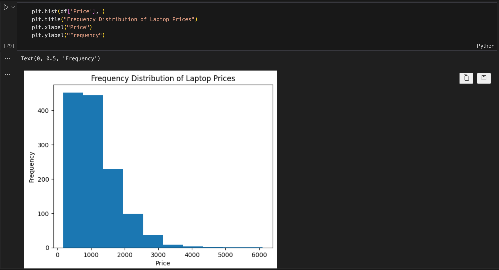

# **Data Analysis of the Iris and Laptop Prices Datasets**  
*Exploratory analyses and visualizations*

[](LICENSE)  

---

## **Table of Contents**  
1. [About the Project](#about-the-project)  
2. [Features](#features)  
3. [Installation](#installation)  
4. [Usage](#usage)  
5. [Contributing](#contributing)  
6. [License](#license)  
7. [Contact](#contact)  

---

## **About the Project**  
### *Brief Description*  
This project provides brief data analyses of the Iris and laptop prices dataset, both of which constitute structured data. Insights gained from this project may be used to inform machine learning development.

### **Technologies Used**  
- Python
- Jupyter Notebook

## **Features**  
- ✅ Feature 1: Analyses and correlation of various features of the datasets, including k-means clustering
- ✅ Feature 2: Visualizations using matplotlib and seaborn 
- ✅ Feature 3: Sample datasets included for quick testing

---

## **Installation**  
### **Prerequisites**  
- Install Python 3.x  
- Install pip and virtualenv  

### **Steps**  
1. Clone the repository:  
   ```bash  
   git clone https://github.com/LopezJER/miniproject1 
   cd repository  
2. Optional but recommended: create a virtual environment
   ```bash
   python -m venv env
   source env/bin/activate  # On Windows, use `env\Scripts\activate`  
3. Install dependencies 
   ```bash
   pip install -r requirements.txt

### **Usage**  
1. Launch Jupyter Notebook
   ```bash
   jupyter notebook  
2. In your browser, navigate to miniproject.ipynb in your Jupyter interface and start running the cells.
3. Follow the instructions provided in the notebook, running each cell sequentially. For example, running the cell below displays a histogram of laptop prices:




### **Contributing**  
Contibutions are welcome. To contribute:
1. Fork the repository
2. Create a feature branch
   ```bash
   git checkout -b feature/YourNewAnalyses
3. Commit your changes
   ```bash
   git commit -m 'analyzed new data'
4. Push to the branch:
   git push origin feature/YourNewAnalyses
5. Create a pull request.

### **License**  
This project is licensed under the MIT License. See the LICENSE file for details.

### **License**  
This project is licensed under the MIT License. See the LICENSE file for details.

### **Contact**  
- Iking Lopez - ikinglopez1@gmail.com
- Project Link - https://github.com/LopezJER/miniproject1/